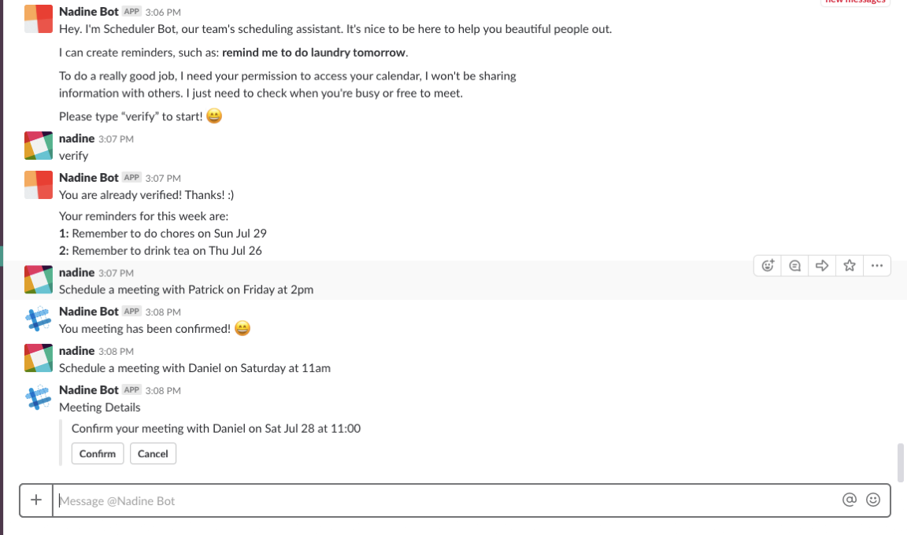
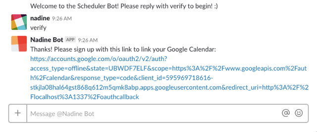
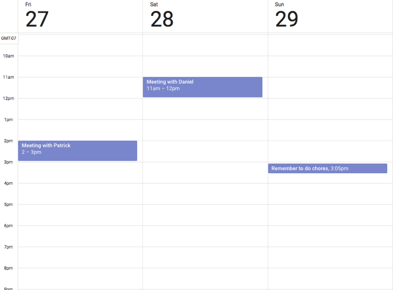

# Slack Scheduler Bot

This software bot is a fully integrated Slack application that helps schedule meetings for you and your team. The app was built by Daniel, Nadine, and Patrick over the course of a week. It was built using Javascript and include features such as:

- Diagloflow API for understanding key phrases through NLP and Machine Learning
- MongoDB and mLab for saving meetings and Google OAuth tokens
- Google Calendar API for automated event adding
- Slack Real Time Messaging API for seamless communication between the user and bot

## Screenshots

### Bot Interaction

### Verification process

### Google Calendar

